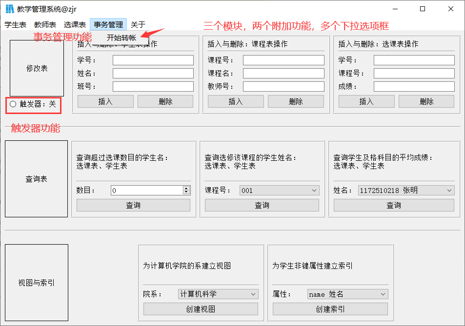
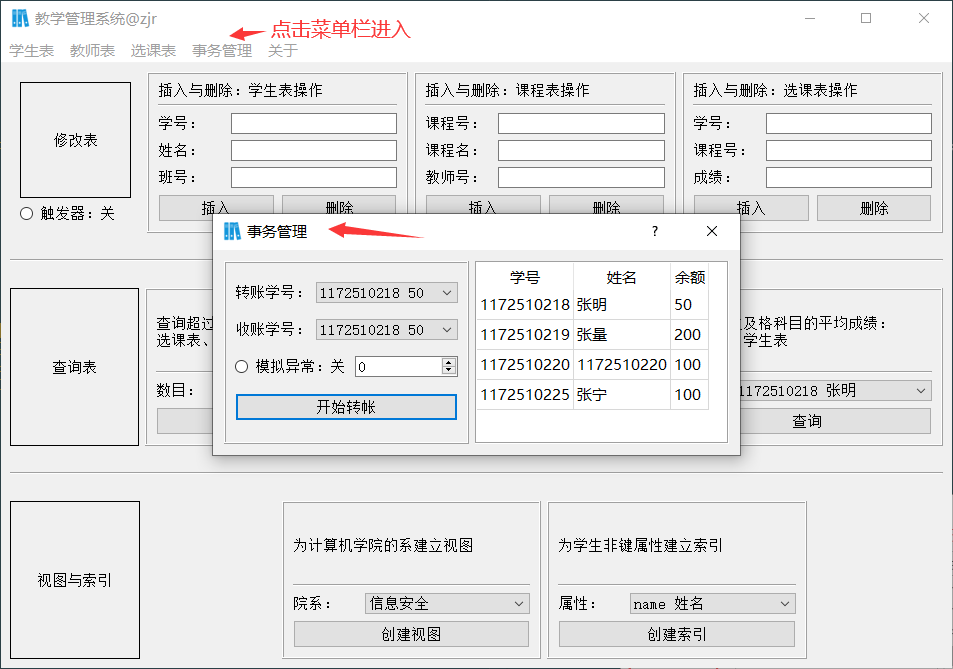

# 实验一：数据库系统应用开发
## 完成部分
- 所有基本功能
  - 插入与删除合法元素
  - 插入与删除空值
  - 插入重复值、删除不存在值
  - 参照完整性约束实现
  - 连接查询、分组查询、嵌套查询：体现分组和Having语句
- 触发器实现参照完整性约束
- 事务管理实现转账操作
- 界面友好
  - 用户少输入，操作便捷
  - 多选项框，保证健壮性
  - 非法操作警告弹窗，提示信息完整
  - 菜单栏的设计，使得设计的功能模块很合理
## 如何运行
- 开发环境：Pycharm 2020.1 专业版
- 语言与平台：Python3.6 Anaconda
- 运行程序
  - 以db_lab作为项目目录
  - 运行main.py即可
## 运行截图
- 主界面
- 视图创建界面
- 事务管理界面