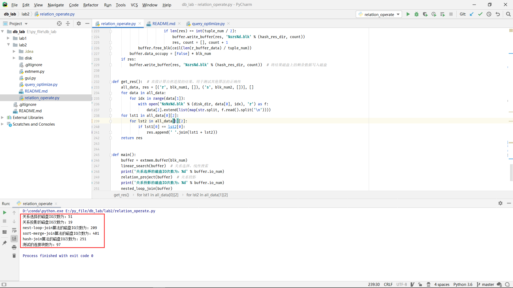
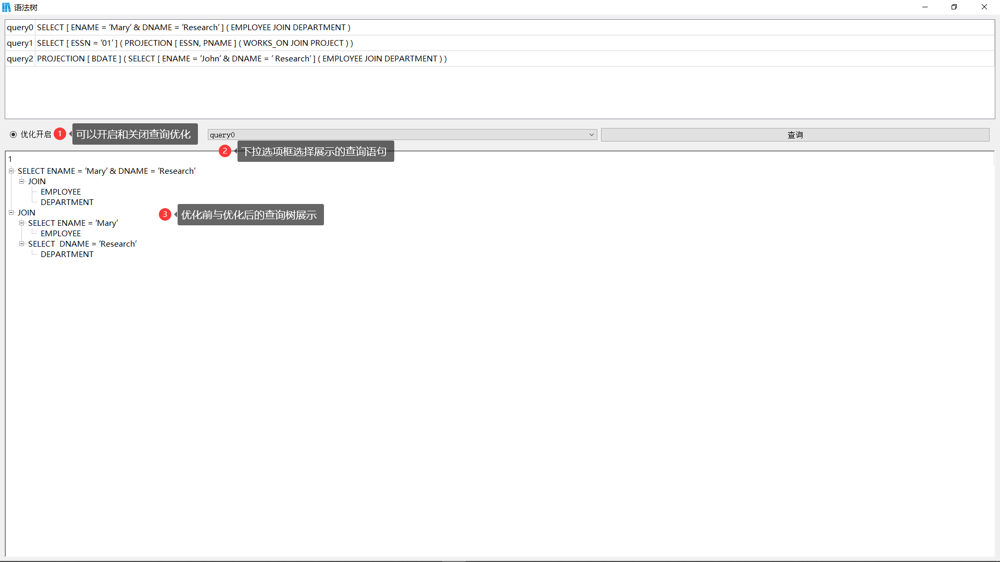

# 实验二：存储管理与查询优化算法的设计
## 还有哪些不足
- 磁盘操作中需要做的部分以**todo**标识
- 查询优化操作中未实现**投影操作**的优化
## 准备部分
- 根据原extmem.c程序的设计思想写出类似的python代码extmem.py
- 生成关系R和S的数据：extmem.gene_data()
- 将数据写入到模拟磁盘中：extmem.write_disk()
## 存储管理
- 关系选择
  - 线性选择，顺序遍历所有的关系磁盘块
  - 将缓冲区的1块作为关系数据输入块，1块作为输出块
  - 磁盘IO为`B(r)+B(t)`
- 关系投影
  - 需要去重，顺序遍历所有的关系磁盘块
  - 将缓冲区的1块作为关系数据输入块，B(buffer)-1块作为输出块
  - 结果需要排序去重（外排序）
- nested-loop-join
  - 关系R做外层循环内容，S做内层循环内容
  - 缓冲区的B(buffer)-2块作为R数据输入块，1块做S数据输入块，1块作为输出块
  - 磁盘IO为`B(r)+B(r)*B(s)/(B(buffer)-2)+B(t)`
- sort-merge-join：由于(B(buffer)-1)^2<B(r)和B(s)，所以可采用两阶段归并算法排序
  - 块内排序：缓冲区B(buffer)-1块作为数据输入，1块作为数据输出；故写入磁盘的结果中每B(buffer)-1块是有序的
  - 块间排序：缓冲区1块作为整体有序数据输出块，其余块作为输入块，依次取有序磁盘块中的1块，不断选取其中最小的元组
  - 连接操作：设置2个游标不断滑动，若从R中取到的数据较小，则滑动R的游标；若较大，则滑动S的游标；否则，输出该结果，并生成2个临时游标，临时滑动关系R或S的数据直到两者数据不相同。最终原游标分别滑动一个元素
- hash-join
  - 划分数据桶：划分为B(buffer)-1个数据桶，缓冲区的B(buffer)-1块用作数据桶暂存，1块用作数据输入
  - 执行连接操作：循环B(buffer)-1次，对每个桶执行连接操作；将缓冲区中的B(buffer-2)块作为关系R的输入块，1块作为关系S的输入快，1块作为输出块
## 查询优化
- 构建查询树：遇到(说明开始查询子句，遇到[说明开始属性及对应值
- 优化：将select选择操作和投影操作尽可能地移向查询树的叶节点
## 如何运行
- 开发环境：Pycharm 2020.1 专业版
- 语言与平台：Python3.6 Anaconda
- 运行程序
  - 以db_lab作为项目目录
  - 运行main.py即可
## disk文件说明
- [relation](./disk/relation)：生成的关系数据文件
- [select](./disk/select/)：选择操作的结果文件
- [project](./disk/project/)：投影操作的结果文件
- [join](./disk/join/)：连接操作的中间及结果文件
  - [nlj](./disk/join/nlj/)：nlj连接操作的结果文件
  - [sort](./disk/join/sort/)：sort-merge-join的中间及结果文件
    - [sort](./disk/join/sort/sort/)：排序后的结果文件
    - [res](./disk/join/sort/res/)：连接操作的结果文件
  - [hash](./disk/join/hash/)：hash-join的中间及结果文件
    - [hash](./disk/join/hash/hash/)：经hash操作后的结果文件
    - [res](./disk/join/hash/res/)：连接操作的结果文件
##  运行截图
- 磁盘操作截图：
- 查询优化截图(gui展示)：